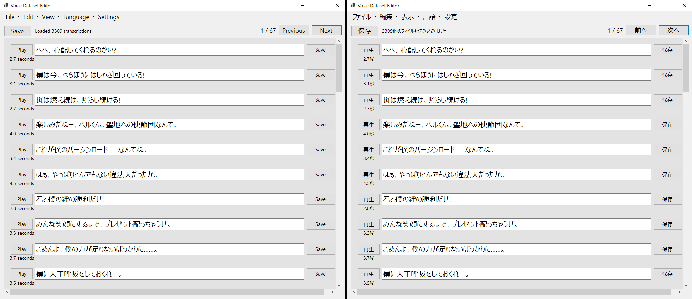

# VoiceDatasetEditor

[English]()

Voice Dataset Editorは、音声テキストデータセットを編集するためのアプリケーションで、日本語にローカライズされています。

[最新リリースはこちら](https://github.com/hopto-dot/VoiceDatasetEditor/releases/latest)



Voice Dataset Editorは、以下の形式の`.list`ファイルをサポートしています:
```
音声ファイル名.wav|話者名|言語|書き起こし
```

例えば、以下のファイルは有効です:
```
voice_0-0.wav|Hestia|JP|へへ、心配してくれるのかい?
voice_0-1.wav|Hestia|JP|僕は今、べらぼうにはしゃぎ回っている!
voice_1.wav|Hestia|JP|炎は燃え続け、照らし続ける!
```

# 機能
- [X] .listファイルをアプリケーションにドラッグ&ドロップして読み込む、または、[ファイル > データセットを読み込む]から.listファイルを選択して読み込む
- [X] 各行を編集し、書き起こしの横にある保存ボタンをクリックして個別の書き起こしを保存する
- [X] ページ上部の保存ボタンを使って、現在のページの全ての書き起こしを一括保存する
- [X] 設定でページごとに表示するアイテム数を変更できる
- [X] アプリケーションは英語と日本語で表示可能
- [X] システムの言語が日本語の場合、プログラムは自動的に日本語で表示される
- [X] 検索と置換
- [X] データセットをファイル名、書き起こし、オーディオの長さでソート
- [X] 文字起こしがない音声ファイルを音声フォルダから移動する  
- [X] 条件に基づいて文字起こしを削除する（音声の長さ、文字起こしの内容など）
- [ ] 先頭と末尾の文字をトリミングする
- [ ] フォントサイズ、アイテム幅などの表示設定の追加
- [ ] 他の表示言語のサポート（要望に応じて）

