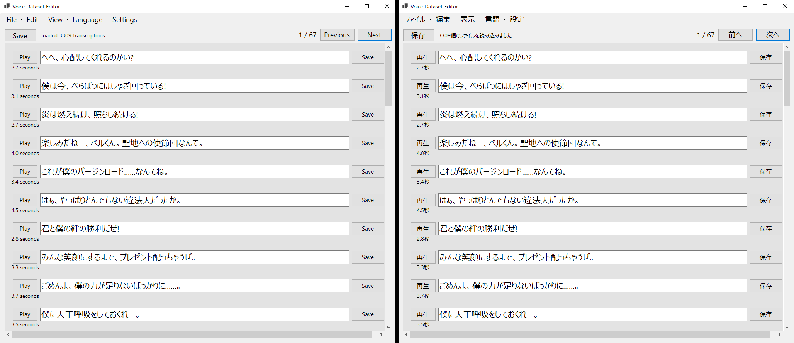

# VoiceDatasetEditor
[日本語はこちら](README-JA.md)

Voice Dataset Editor is a simple program for editing audio-text datasets.

[Latest release here](https://github.com/hopto-dot/VoiceDatasetEditor/releases/latest)



Voice Dataset Editor supports `.list` files in the format:
```
audio_file_name.wav|speaker_name|language|transcription
```

For example, the following file is valid:
```
voice_0-0.wav|Hestia|JP|へへ、心配してくれるのかい?
voice_0-1.wav|Hestia|JP|僕は今、べらぼうにはしゃぎ回っている!
voice_1.wav|Hestia|JP|炎は燃え続け、照らし続ける!
```

# Features
- [X]  Drag and drop `.list` files into the application to load, OR, go to [File > Load dataset] then find and select the .list file
- [X]  Edit lines and click save next to the transcription to save individual transcriptions
- [X]  Save all transcriptions on the current page with the Save button at the top
- [X]  Change how many items are shown per page in the settings
- [X]  Application can be displayed in English or Japanese
- [X]  The program is automatically displayed in Japanese if it detects your system language is Japanese
- [ ]  Search and replace
- [ ]  Add display settings such as font size, item width and more
- [ ]  Possible support for other display languages (if in demand)
